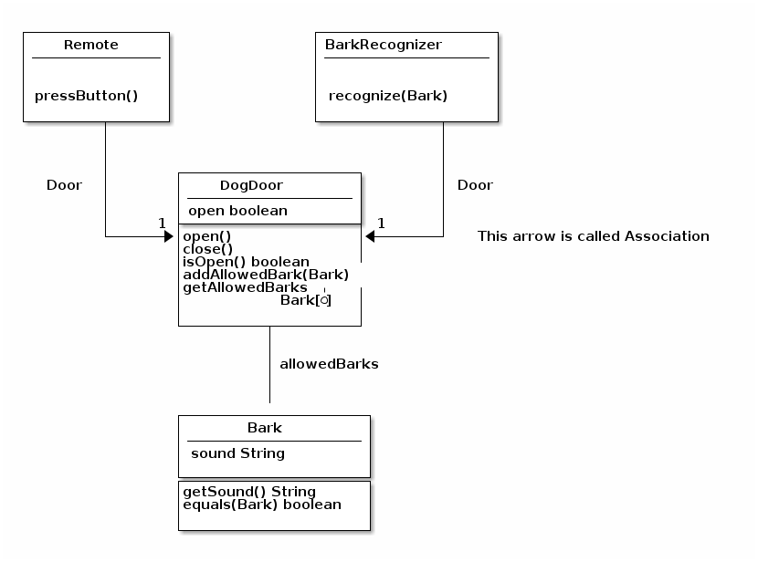

Head First Object Oriented Analysis & Design (OOAD) Chapter 04
=
This is the fourth Chapter learning of **Head First Object Oriented Analysis & Design (OOAD)** by **Bertt Mclaughlin**,**Gary Pollice** and **David West** 
This markdown file is my notes for the fourth chapter, not sure if any copyright issues are there.


Analysis
-

### BULLET POINTS
* Analysis helps you ensure that your software works in the real world context, and not just in a perfect environment.
* Use cases are meant to be understood by you, your managers, your customers, and other programmers.
* You should write your use cases in whatever format makes them most usable to you and the other people who are looking at them.
* A good use case precisely lays out what a system does, but does not indicate how the system accomplishes the task.
* Each use case should focus on only one customer goal. If you have multiple goals, you will need to write multiple use cases.
* Class diagrams give you an easy way to show your system and its code constructs at a 10,000 - foot view.
* The attributes in a class diagrams usually map to the member variables of your class.
* The operations in a class diagrams usually represent the method of your classes.
* Class diagrams leave lots of details out, such as class constructors, some type information, and the purpose of operations on your classes.
* Textual analysis helps you translate a use case into code-level classes, attributes, and operations.
* The nouns of a use case are candidates for classes in your system, and the verbs are candidates for methods on your system's classes.
* **Delegations** shields your object from implementation changes to other objects in your software.

### UML Terms
````java
allowedBarks: Bark[*]
````
[] indicates the **multiplicity** of an attributes: how many of a certain type that the attributes can hold.

[*] the * indicates that allowedBarks can hold an unlimited number of Bark object.

### Class Diagram
A sample class diagram is as below



**Association** : A solid line from one class to another is called an association. It means that one class is associated with another class by reference, extension, inheritance etc.

