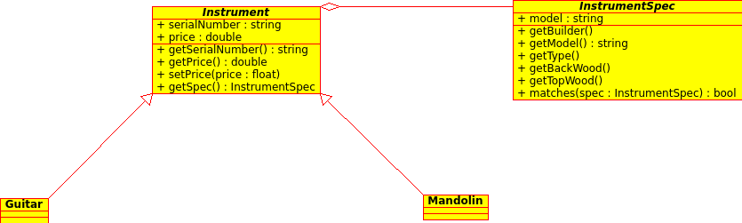
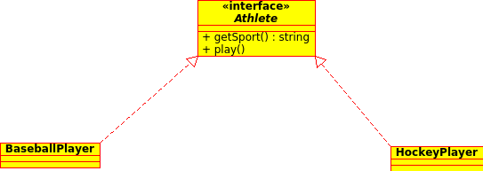
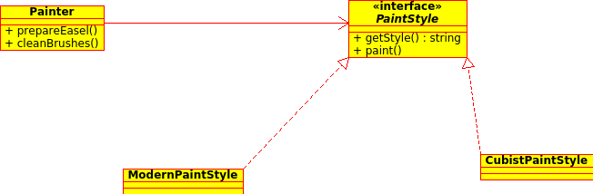

Head First Object Oriented Analysis & Design (OOAD) Chapter 05
=
This is the fifth Chapter learning of **Head First Object Oriented Analysis & Design (OOAD)** by **Bertt Mclaughlin**,**Gary Pollice** and **David West** 
This markdown file is my notes for the fifth chapter, not sure if any copyright issues are there.

Good Design
-

### UML Terms

### Class Diagram
A sample class diagram is as below

**Aggregation** : The line in the above diagram with a diamond means **aggregation**. Aggregation is a special form of association, and means that one thing is made up (in part) of another thing.
**Generalization** : The line in the above diagram with a arrow that isn't colored in means **generalization**. We use generalization to show that a class extends and inherits behavior from a more generalized class.
**Abstract Class** :  An abstract class in UML diagram is represented by italicized name.

### Interface
A sample Interface diagram is shown below.

* Always code to the interface and not to the implementation.
* Coding towards interface is flexible as the code will work with all of the interface subclass - even ones that haven't been created yet.

### Encapsulation
We should protect the classes from unnecessary changes.

Just for reference check the below class diagram.

In this above class diagram, the *paint()* method would change very frequently. So we can move that particular method into a separate class or interface.

Each class should have only one reason to change. So one class should not do to many things.