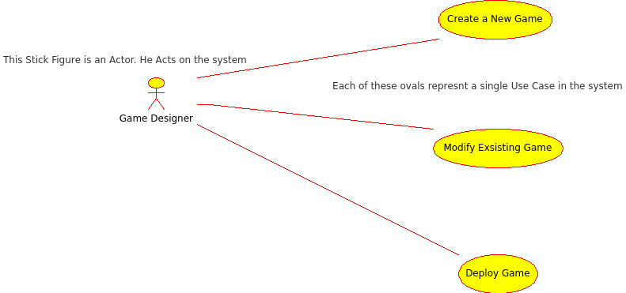
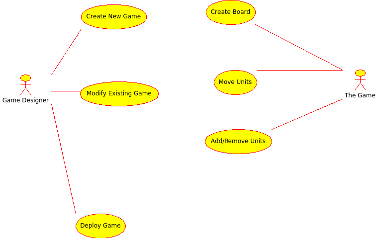

Head First Object Oriented Analysis & Design (OOAD) Chapter 06
=
This is the sixth Chapter learning of **Head First Object Oriented Analysis & Design (OOAD)** by **Bertt Mclaughlin**,**Gary Pollice** and **David West** 
This markdown file is my notes for the sixth chapter, not sure if any copyright issues are there.

Solve Big Problem
-

Q. How do we solve big problems with OOAD?
A. We solve it in the same we solved Small Problem in these 4 steps.

1. Make Sure your software does what the customer wants it to do.
2. Apply basic OO principle to add flexibility.
3. Strive for a maintainable reusable design.
4. Break down the big problem into lot of functional pieces, and then work on those pieces individually.

### What Should you do first?

* Requirements and use cases are a good place of start.
* But to make the above you have to first understand the customer and from his understanding can you find out some things about how the system functions or behaves.

### Information, Feature and Requirements.

* **Feature** us just a *high-level description* of something a system needs to do.
* You generally get feature from talking to your customers.
* A lot of time you can take one feature and come up with several different requirements that you can use to satisfy the feature.

#### Golden Rule
* **Get Feature from the customer, and then figure out the requirements you need to implement those features.**

### UseCase:-

* Use cases don't always help you see the big picture.
* You need to know what your system is supposed to do... but you need a BIG-PICTURE view.

#### UseCase Diagrams.

Sometimes you need to know what a system does, but don't want to get into all the details that use cases require. when you are in a situation like this, a use case diagram could be just what you need.

* USe case diagrams are the blueprints for your system.
* Use your feature list to make sure your use case diagram is complete.
* **<<includes>>** in UML and use case diagrams means that one use case includes another.
* **<<extends>>** in UML and use case diagrams means that one use case extends another.
* Use case diagrams are a way to get a clear 10,000 foot view of your system.
* **Actors** are not only people it can also be another component. As explained in this diagram.

### Domain Analysis

* Domain Analysis lets you check your design, and still speak the customer's language.
* Domain analysis helps you avoid building parts of a system that aren't your job to build.
* Once you have found out you Modules from Domain Analysis, only thing left will be applying pre-exsisting design Patterns to the problem.

### BULLET POINTS
* The best way to look at a big problem is to view it as a collection of smaller problems.
* Just like in small projects, start working on big projects by gathering features and requirements.
* Features are usually 'big' things that a system does, but also can be used interchangeably with the term "requirements".
* Commonality and variability give you points of comparison between a new system and things you already know about.
* Use cases are detail-oriented; use case diagrams are focused more on the big picture.
* Your use case diagram should account for all the features in your system. 
* Domain analysis is representing a system in language that the customer will understand.
* An actor is anything that interacts with your system, but isn't part of the system.

